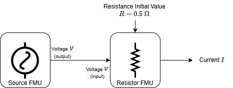

# 🚀 Getting Started with CoFMPy

CoFMPy is a framework designed to make co-simulation and prototyping digital twins easy and efficient. This guide walks you through setting up and running a your first simulation with CoFMPy!

## 🐾 Installation

Before you begin, ensure CoFMPy is installed:

```bash
pip install cofmpy
```

## 💻 Running Your First Simulation

With CoFMPy, you can simulate complex systems composed of multiple FMUs connected together. You can even integrate external files or network interfaces.
For now, we will keep it simple and consider the system consisting of an alternating voltage source and a resistor, as shown in the figure below:

<figure style="text-align:center">

</figure>

* The source outputs a voltage signal, denoted as $V$ (in Volts).
* The resistor takes $V$ as input and produces an output current $I$ (in Amperes). The resistance parameter $R$ is set to $0.5$ \Omega$.

We've already prepared FMUs and configuration file associated to this scenario. Let's start by downloading them.

```python
import os
import urllib.request
import zipfile

url = "https://share-is.pf.irt-saintexupery.com/s/39zaG9HkQWnePbi/download"
resources_path = "example1.zip"

urllib.request.urlretrieve(url, resources_path)
with zipfile.ZipFile(resources_path, "r") as zip_ref:
    zip_ref.extractall(".")
os.remove(resources_path)

print("Resources unzipped in example1 folder!")
```

### Step 1: Instantiate the Coordinator

The heart of CoFMPy is the `Coordinator`, which is responsible for managing the simulation process. We begin by instantiating it and loading the configuration file just downloaded above:

```python
# Import the main CoFMPy component
from cofmpy import Coordinator

# Create an instance of the Coordinator
coordinator = Coordinator()

# Load the simulation setup from a JSON configuration file
coordinator.start("example1/config.json")
```

To make sure your simulation is correctly set up, you can visualize the connection graph of your system:

```python
# Display a graphical representation of the simulated system
graph = coordinator.graph_engine.plot_graph()
graph.show()
```

### Step 2: Execute a Simulation Step or run it until completion

Here, you can either execute the simulation step by step or run it until completion.

```python
# Define the time step for the simulation
step_size = 0.05

# Run a single step of the simulation
coordinator.do_step(step_size)

# Print the current time in the simulation
print(f"Current simulation time: {coordinator.master.current_time}")

# Alternatively, run the co-simulation until a specified end time
end_time = 0.5
coordinator.run_simulation(step_size, end_time)
print("Simulation completed!")
```

### Step 3: Access Results

Once the simulation is finished, you can retrieve and inspect the results.

```python
# Retrieve stored simulation results
results = coordinator.get_results()

# Display a preview of the results
print(results[("source", "V")])
print(results[("resistor", "I")])
```

## ⏭ What’s Next?

- Try modifying the configuration file to explore different scenarios.
- Experiment with different step sizes to see how they affect results.
- Explore CoFMPy's [examples gallery](generated/gallery/index.md).
- Dive deeper into advanced features by checking the official documentation.
