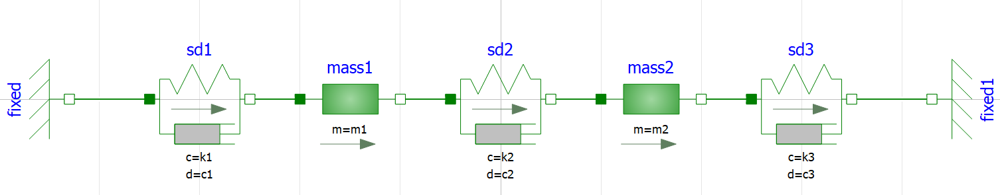

# Use case "Dual Mass Oscillator"

The DMO system is composed of two masses and three spring dampers. The system is split
into two subsystems:

- DualMassOscillator.System1: the first mass and the first spring damper.
- DualMassOscillator.System2: the second mass and the second and third spring dampers.

## Inputs and outputs

- System1:
  - input: `F` (the force that spring2 applies to mass1)
  - outputs: `x1`, `v1` and `a1` (the position, speed and acceleration of mass1)
- System2:
  - inputs: `x1`, `v1` and `a1` (the position, speed and acceleration of mass1)
  - output: `F` (the force that spring2 applies to mass1)

The FMUs are connected with 4 connections:

- System1.x1 -> System2.x1
- System1.v1 -> System2.v1
- System1.a1 -> System2.a1
- System2.F -> System1.F

## Download FMUs

FMUs are available in the GitHub repo of OMSimulator:

- https://github.com/OpenModelica/OMSimulator/tree/master/testsuite/resources/DualMassOscillator.System1
- https://github.com/OpenModelica/OMSimulator/tree/master/testsuite/resources/DualMassOscillator.System2

Commit: d2465f80ad8c3dd652a727c6311d74be4ee598da

FMUs are in version 2.0 and work with Linux and Windows.

## Default FMU values

All variables are not presented here. Only the "most important" variables are given.

### System1

- F = 0 (causality="input"). Must be set by fixed-point initialization
- m1 = 1.0 (causality="parameter", mass of mass1)
- k1 = 10.0 (causality="parameter", spring constant of sd1)
- c1 = 0.2 (causality="parameter", damping constant of sd1)
- x1_start = 0 (causality="parameter", initial position of mass1)

### System2

- x1 = 0 (causality="input"). Must be set by fixed-point initialization
- v1 = 0 (causality="input"). Must be set by fixed-point initialization
- a1 = 0 (causality="input"). Must be set by fixed-point initialization
- m2 = 1.0 (causality="parameter", mass of mass2)
- k2 = 10.0 (causality="parameter", spring constant of sd2)
- c2 = 0.5 (causality="parameter", damping constant of sd2)
- k3 = 20.0 (causality="parameter", spring constant of sd3)
- c3 = 0.3 (causality="parameter", damping constant of sd3)
- x2_start = 0.5 (causality="parameter", initial position of mass2)

## Initialization

The simulation (with default values) was performed with OpenModelica. The initialization
is:

- System1.F = 5
- System2.x1 = 0
- System2.v1 = 0
- System2.a1 = 5

See table for the two first time steps:

| Time  | x1      | v1     | a1     | F      |
|-------|---------|--------|--------|--------|
| 0     | 0       | 0      | 5      | 5      |
| 0.002 | 9.98e-6 | 0.0099 | 4.9775 | 4.9796 |

## Simulation results

See [CSV file](./results_DualMassOscillator.csv) for simulation results from
OpenModelica.
