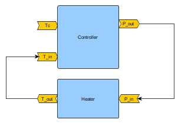
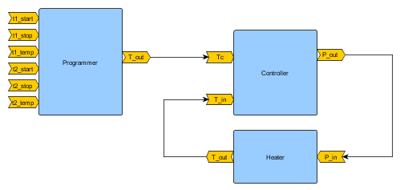

# Use case "Heat Controller"

This use case represents a heater regulated by a proportional controller. The system is
split into two subsystems simulated with two FMUs generated from Python code. As an option, the consign temperature 
of the heater controller can be set by another subsystem named Programmer

- `Heater.fmu`: an FMU that takes as inputs the previous temperature and the heat
  command, and returns the new temperature. The new temperature follows
  `T_out = T_in + dt * (P_in/100 - heat_loss)`.
- `HeatController.fmu`: an FMU that takes as input the temperature and the setpoint
  temperature `Tc` and returns the heat command to give to the heater.
- `Programmer.fmu`: an FMU that simulates a temperature programmer with 2 ranges.
  It returns the current temperature pending time and these ranges.

## Inputs and outputs

- Heater:
  - input: `P_in` (the heat power of the heater)
  - outputs: `T_out` (the temperature of the heater)
- HeatController:
  - inputs: `T_in` and `Tc` (the temperature of the heater and the setpoint temperature)
  - output: `P_out` (the power to apply to the heater)
- Programmer:
  - inputs: `t1_start`, `t1_stop` and `t1_temp`, `t2_start`, `t2_stop` and `t2_temp` : parameters for the 2 ranges
  - output: `T_out` (the desired temperature for the time)

**First and simple use case** with only Heater and HeatController : The FMUs are connected with 2 connections:
- Heater.T_out -> HeatController.T_in
- HeatController.P_out -> Heater.P_in
<p align="center">
  
</p>

**Second and more complex use case** with only Programmer, Heater and HeatController : The FMUs are connected 
with 3 connections:
- Programmer.T_out -> HeatController.Tc
- HeatController.P_out -> Heater.P_in
- Heater.T_out -> HeatController.T_in
<p align="center">
  
</p>

## Generate the FMUs

The FMUs are not directly provided but 3 Python scripts are given. You can generate
the FMUs using `pythonfmu`.

Run the Python script `generate_fmus.py` (make sure `pythonfmu` is installed):

```bash

python generate_fmus.py
```

You can find details about the behaviour of the FMUs in the Python scripts `programmer.py`, `heater.py`
and `heat_controller.py`.

## Run notebook

**First and simple use case :** :
The `config.json` file contains the configuration for the CoFmuPy simulation. You can
execute the notebook `heat_controller.ipynb` to run the co-simulation.

**Second and more complex use case :**
The `config_gauss_seidel.json` and `config_jacobi.json` files contains the configurations for the CoFmuPy
simulation. You can execute the notebook `test_heater_gauss_seidel.py` and `test_heater_jacobi.py` 
to run the co-simulation.
